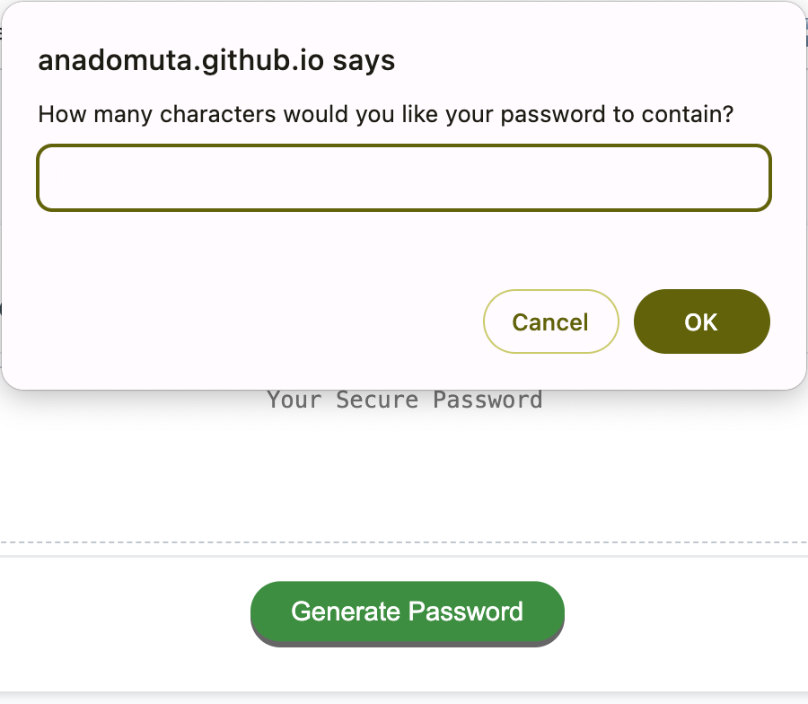

# Random Password Generator

## Description

The project represents an application that a user can use to generate a random password based on criteria they’ve selected by modifying starter code.

The user is prompted to select:

- Length of password between 8 and 128 characters
- Use of special characters
- Use of numeric characters
- Use of lowercase characters
- User of uppercase characters

The code validates for each input and alerts the user when no character type was selected.

Once all prompts are answered, the password is generated and written to the page.

## Usage

The webpage can be accessed using this URL: link to follow

To generate the random password, the user can tap on the button "Generate password" and input the preferences for the length and type of characters that he prefers.

The screenshot below displays an overview of the application.

## Credits

The project was built following the instructions from the materials in the Skills Bootcamp in Front-End Web Development by edX.

In addition, the following resources were used:

1. W3Resource Article: [JavaScript: Get a random item from an array
   ](https://www.w3resource.com/javascript-exercises/javascript-array-exercise-35.php)
2. Tutoring session to add recursiveness in the prompts
3. Markdown badges from [ileriayo](https://github.com/Ileriayo/markdown-badges?tab=readme-ov-file#markdown-badges)

## License

This project is licensed under the terms of the MIT license.

## Badges

